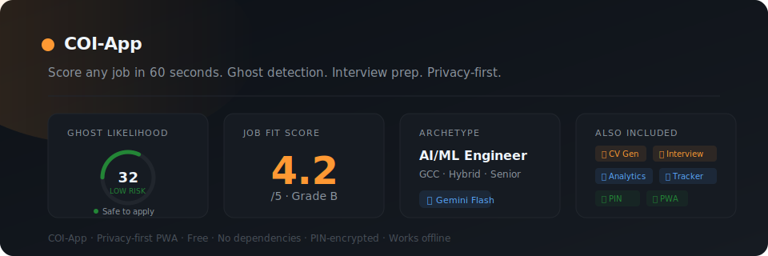

# Career-Ops-India App aka COI-App

> AI-powered job evaluation for the Indian job market.
> Score any job in 60 seconds. Zero setup. Privacy-first. PIN-encrypted.

**Live app:** [itsmedhawal.github.io/career-ops-india-app](https://itsmedhawal.github.io/career-ops-india-app)

Built on [career-ops-india](https://github.com/itsmedhawal/career-ops-india), which is forked from [career-ops](https://github.com/santifer/career-ops) by Santiago Fernández de Valderrama.

---

## What it does

Paste any job description. Get a structured evaluation in under 60 seconds -- or an instant local GLS scan with zero API cost.

- **Ghost Likelihood Score (GLS)** -- 0–100 across 9 India-calibrated signals
- **Fast Scan** -- instant local GLS via Gemma 2 2B running entirely on your device (WebGPU)
- **Deep Eval** -- full A–G report via Claude API: CV match, comp analysis, level strategy, interview plan
- **Take-Home Calculator** -- CTC → in-hand estimate (new tax regime FY25–26)
- **Custom CV Generator** -- tailored CV for each specific role, downloadable as .doc
- **Interview Prep Kit** -- STAR+R stories, CTC negotiation, India-specific HR scenarios
- **Pipeline Tracker** -- manage all applications with status, filters, and follow-up reminders
- **Analytics** -- application funnel, ghost rate by source, archetype breakdown
- **Intern Mode** -- PPO probability, stipend benchmarks by city for students and freshers
- **Repost Detection** -- fingerprints every JD locally, flags if you have seen this role before
- **PIN-Encrypted API Key** -- WebCrypto AES-GCM. Your key is encrypted before touching storage
- **Offline-First PWA** -- installable on Android and iOS, works offline for Tracker and Analytics

---

## Hybrid Intelligence Architecture (v7.0)

The first app in India to offer a hybrid Ghost Buster -- local + cloud, mobile-first, privacy-first.

| Mode | Engine | Cost | Connectivity |
|------|--------|------|-------------|
| **Fast Scan** | Gemma 2 2B (on-device, WebGPU) | Free | Offline after first download |
| **Deep Eval** | Claude Sonnet API | API credits | Online |
| **Fast Scan fallback** | Claude API (when WebGPU unavailable) | API credits | Online |

**Phase 1 (Now):** Gemma 2 2B Lite -- instant local GLS, ~1.6 GB one-time download

**Phase 2 (May 2026):** One-tap upgrade to Gemma 4 E2B when MLC community compiles it

### Sync Command Center
Download Offline Intelligence once over WiFi. After that, GLS scans are instant, free, and fully offline. Your phone becomes a sovereign job assessment tool.
career-ops-india-app/

├── index.html     ← full app, single file

├── worker.js      ← Web Worker for local AI inference

├── manifest.json  ← PWA manifest

├── README.md

└── LICENSE

---

See [CHANGELOG.md](CHANGELOG.md) for full version history.

---

## How to Use

1. Open the app -- no installation needed
2. **Profile tab** → add a Claude or Gemini API key → paste CV → tap Extract from CV
3. **Evaluate tab** → paste any job description → tap Evaluate Job
4. Review Score, Grade and GLS → decide whether to apply
5. Save to **Tracker** → manage your full pipeline
6. From any tracker card → **✍️ CV** to generate a tailored CV, **🎤 Prep** for interview prep

---

## Privacy & Security

- Your CV, API key, and job data never leave your browser
- The only external calls are your direct API requests to Anthropic or Google
- API key encrypted with a 4-digit PIN using AES-GCM before storage
- Decrypted key lives only in session memory -- cleared when tab closes
- No analytics, no cookies, no third-party scripts

---

## Tech Stack

| Layer | Stack |
|-------|-------|
| Runtime | Single HTML file -- no build step, no dependencies |
| AI | Anthropic Claude API · Google Gemini API (direct browser calls) |
| Storage | localStorage + IndexedDB |
| Security | WebCrypto AES-GCM + PBKDF2 (310,000 iterations) |
| CV Export | HTML → .doc (opens in Word and Google Docs) |
| PDF Export | window.print() with print stylesheet |
| PWA | manifest.json -- installable, works offline |
| Fonts | Space Grotesk · DM Sans · JetBrains Mono |

---

## Lineage

career-ops (Santiago Fernández de Valderrama)

└── career-ops-india (Dhawal Shrivastava)

└── Career-Ops-India App (Dhawal Shrivastava) ← you are here

---

## Credits

**Dhawal Shrivastava** -- Creator of Career-Ops-India App and the career-ops-india fork.
Original contributions: Ghost Likelihood Score (GLS), Intern Mode, India archetypes, CTC/LPA framework, GCC stage, Fake Remote detection, Custom CV Generator, Interview Prep Mode.
[GitHub](https://github.com/itsmedhawal/career-ops-india) · [LinkedIn](https://www.linkedin.com/in/dhawalshrivastava)

**Santiago Fernández de Valderrama** -- Creator of [career-ops](https://github.com/santifer/career-ops), the engine career-ops-india is forked from. Architecture, pipeline, PDF generation, batch processing, and HITL philosophy are his work.
[santifer.io](https://santifer.io)

---

## Contribute

Open source under MIT:
- 🌐 Hindi language modes
- 🏢 More Indian company and GLS signal data
- 📊 Better compensation band data
- 💰 Updated city-wise stipend benchmarks

[Submit feedback via GitHub Discussions](https://github.com/itsmedhawal/career-ops-india-app/discussions)

---

*Made with Love and Innovation, driven by Intention, dedicated to the community.*
*-- [Dhawal Shrivastava](https://www.linkedin.com/in/dhawalshrivastava)*
